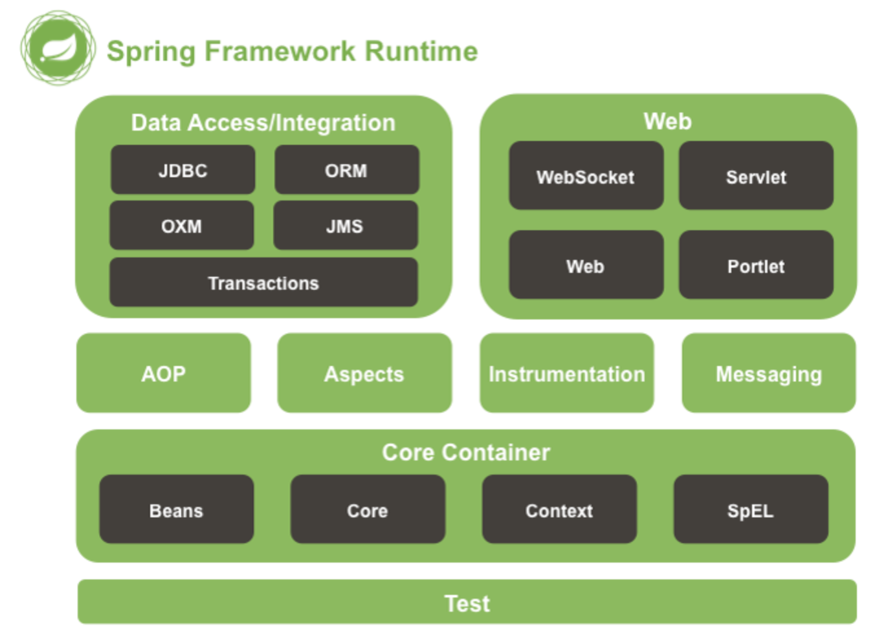

#### 최초 작성일 : 2021.08.10(화)

# Boostcourse Java Back-end 과정 학습

여기서는 Boostcourse Spring Framework DI/IoC, AOP, JUnit Test 학습을 진행한다.

## 학습 환경

1. OS : MacOS
2. JDK : OpenJDK 11.0.5
4. Build Tools : Maven
5. Database : MySQL
6. IDE: IntelliJ IDEA Ultimate

## IntelliJ Spring Framework 프로젝트 설정 방법

### Maven 프로젝트 설정

1. IntelliJ에서 New Project 선택
   
2. `Maven` 선택, `org.apache.maven.archetypes:maven-archetype-webapp` 선택 후 Next 버튼 클릭
   
3. `GroupId`, `ArtifactId`, `Version` 설정 후 Next 버튼 클릭
   
    - GroupId는 보통 프로젝트를 진행하는 회사나 팀의 도메인 이름을 거꾸로 적는다.
    - ArtifactId는 해당 프로젝트의 이름을 적는다.
    - Version은 보통 기본값(1.0-SNAPSHOT)으로 설정한다.
    - 여기서는 언급되지 않지만 `Package`라는 것이 있는데, 이는 GroupId와 ActifactId가 조합된 형태를 가진다.
4. Finish 버튼 클릭
   

### Spring Framework 프로젝트로 변경

1. `pom.xml` 내용 변경
    - Spring Framework 라이브러리 추가
    - Build 설정
   ```xml
   <?xml version="1.0" encoding="UTF-8"?>
   <project xmlns="http://maven.apache.org/POM/4.0.0"
            xmlns:xsi="http://www.w3.org/2001/XMLSchema-instance"
            xsi:schemaLocation="http://maven.apache.org/POM/4.0.0
                                http://maven.apache.org/xsd/maven-4.0.0.xsd">
       <modelVersion>4.0.0</modelVersion>
       <groupId>kr.or.connect</groupId>
       <artifactId>spring</artifactId>
       <version>1.0-SNAPSHOT</version>
       <packaging>war</packaging>
       <name>spring Maven Webapp</name>
       <url>http://www.example.com</url>
   
       <!-- 프로퍼티 설정 추가 -->
       <properties>
           <project.build.sourceEncoding>UTF-8</project.build.sourceEncoding>
           <maven.compiler.source>11</maven.compiler.source>
           <maven.compiler.target>11</maven.compiler.target>
           <!-- 해당 프로젝트에서 사용하는 Spring Framework 버전 -->
           <spring.version>4.3.14.RELEASE</spring.version>
       </properties>
   
       <dependencies>
           <!-- Spring Framework 라이브러리 추가 -->
           <dependency>
               <groupId>org.springframework</groupId>
               <artifactId>spring-context</artifactId>
               <version>${spring.version}</version>
           </dependency>
   
           <!-- JUnit Test 라이브러리 추가 -->
           <dependency>
               <groupId>junit</groupId>
               <artifactId>junit</artifactId>
               <version>3.8.1</version>
               <scope>test</scope>
           </dependency>
       </dependencies>
   
       <!-- 빌드 설정 추가 -->
       <build>
           <plugins>
               <plugin>
                   <groupId>org.apache.maven.plugins</groupId>
                   <artifactId>maven-compiler-plugin</artifactId>
                   <version>3.6.1</version>
                   <configuration>
                       <source>11</source>
                       <target>11</target>
                   </configuration>
               </plugin>
           </plugins>
       </build>
   </project>
   ```

## Spring Framework



1. 엔터프라이즈급 어플리케이션을 구축할 수 있는 가벼운 솔루션이자, 원스-스탑-숍(One-Stop-Shop).
    - One-Stop-Shop: 모든 과정을 한꺼번에 해결할 수 있다.
2. 원하는 부분만 가져다 사용할 수 있도록 모듈화가 잘 되어 있음.
3. IoC 컨테이너.
4. 선언적으로 트랜잭션을 관리할 수 있음.
5. 완전한 기능을 갖춘 MVC Framework를 제공.
6. AOP 지원
7. 스프링은 도메인 논리 코드와 쉽게 분리될 수 있는 구조로 되어 있음.

### 프레임워크 모듈

1. 스프링은 약 20개의 모듈로 구성되어 있음.
2. 필요한 모듈만 가져다 사용할 수 있음.

### AOP 와 인스트루멘테이션 (Instrumentation)

1. `spring-AOP` : AOP 얼라이언스(Alliance)와 호환되는 방법으로 AOP를 지원.
2. spring-aspects : AspectJ와의 통합을 제공.
3. spring-instrument : 인스트루멘테이션을 지원하는 클래스와 특정 WAS에서 사용하는 클래스로 더 구현체를 제공.
    - 참고로 BCI(Byte Code Instrumentations)은 런타임이나 로드(Load) 때 클래스의 바이트 코드에 변경을 가하는 방법을 말함.

### 메시징(Messaging)

1. `spring-messaging` : 스프링 프레임워크 4는 메시지 기반 어플리케이션을 작성할 수 있는 Message, MessageChannel, MessageHandler 등을 제공.
2. 또한, 해당 모듈에는 메소드에 메시지를 맵핑하기 위한 어노테이션도 포함되어 있으며, Spring MVC 어노테이션과 유사함.

### 데이터 엑서스(Data Access) / 통합(Integration)

1. 데이터 엑세스/통합 계층은 JDBC, ORM, OXM, JMS 및 트랜잭션 모듈로 구성되어 있다.
2. `spring-jdbc` : 자바 JDBC프로그래밍을 쉽게 할 수 있도록 기능을 제공.
3. `spring-tx` : 선언적 트랜잭션 관리를 할 수 있는 기능을 제공.
4. spring-orm : JPA, JDO및 Hibernate를 포함한 ORM API를 위한 통합 레이어를 제공.
5. spring-oxm : JAXB, Castor, XMLBeans, JiBX 및 XStream과 같은 Object/XML 맵핑을 지원.
6. spring-jms : 메시지 생성(producing) 및 사용(consuming)을 위한 기능을 제공, Spring Framework 4.1부터 spring-messaging모듈과의 통합을 제공.

### 웹(Web)

1. 웹 계층은 spring-web, spring-webmvc, spring-websocket, spring-webmvc-portlet 모듈로 구성됨.
2. `spring-web` : 멀티 파트 파일 업로드, 서블릿 리스너 등 웹 지향 통합 기능을 제공한다. HTTP클라이언트와 Spring의 원격 지원을 위한 웹 관련 부분을 제공.
3. `spring-webmvc` : Web-Servlet 모듈이라고도 불리며, Spring MVC 및 REST 웹 서비스 구현을 포함.
4. spring-websocket : 웹 소켓을 지원.
5. spring-webmvc-portlet : 포틀릿 환경에서 사용할 MVC 구현을 제공.

## Spring IoC/DI 컨테이너

### 컨테이너

1. `컨테이너`란 컨테이너는 `인스턴스의 생명주기를 관리`하며, `생성된 인스턴스에게 추가적인 기능을 제공`한다.
    - 예를 들어, Servlet을 실행해주는 WAS는 Servlet 컨테이너를 가지고 있다고 말한다.
        - WAS는 웹 브라우저로부터 서블릿 URL에 해당하는 요청을 받으면, 서블릿을 메모리에 올린 후 실행한다.
        - 개발자가 서블릿 클래스를 작성했지만, 실제로 메모리에 올리고 실행하는 것은 WAS가 가지고 있는 `Servlet 컨테이너`이다.

### IoC(Inversion of Control, 제어의 역전)

1. 컨테이너가 코드 대신 오브젝트의 제어권을 갖고 있어 IoC(제어의 역전)이라 한다.
    - 예를 들어, 서블릿 클래스는 개발자가 만들지만, 그 서블릿의 메소드를 알맞게 호출하는 것은 WAS이다.
    - 이렇게 개발자가 만든 어떤 클래스나 메소드를 `다른 프로그램이 대신 실행해주는 것을 제어의 역전`이라고 한다.

### DI(Dependency Injection, 의존성 주입)

1. DI는 의존성 주입이란 뜻을 가지고 있으며, `클래스 사이의 의존 관계를 빈(Bean) 설정 정보를 바탕으로 컨테이너가 자동으로 연결`해주는 것을 말한다.
    - `빈(Bean)`: `Spring 컨테이너가 관리하는 객체`를 의미한다.
        - 직접 `new 연산자`로 생성하는 객체는 빈(Bean)이 아니다.
    - DI가 적용 안된 (예)
      ```java
      class 엔진 {
      
      }
      
      class 자동차 {
           엔진 v5 = new 엔진();
      }
       ```
      
    - DI가 적용된 (예)
      ```java
      @Component
      class 엔진 {
      
      }
      
      @Component
      class 자동차 {
           @Autowired
           엔진 v5;
      }
      ```
      

### Spring에서 제공하는 IoC/DI 컨테이너

1. BeanFactory
    - IoC/DI에 대한 기본 기능을 가지고 있음.
        - 스프링 설정 파일에 등록된 Bean 객체를 생성하고 관리하는 기본적인 기능만 제공한다.
    - 컨테이너가 구동될 때 Bean 객체를 생성하는 것이 아니라 클라이언트의 요청에 의해서 Bean 객체가 사용되는 시점(`Lazy Loading`)에 객체를 생성하는 방식을 사용한다.
2. ApplicationContext
    - BeanFactory의 모든 기능을 포한다.
        - 일반적으로 BeanFactory보다 `추천`된다.
    - 트랜잭션 처리(관리), 메시지 기반 다국어 처리, AOP 처리 등 IoC/DI 외에도 많은 부분을 지원한다.
    - 컨테이너가 구동되는 시점에 객체들을 생성하는 `Pre-Loading` 방식이 BeanFactory와 가장 큰 차이점이다.
    - `BeanPostProcessor`, `BeanFactoryPostProcessor`등을 자동으로 등록하고, 국제화 처리, 어플리케이션 이벤트 등을 처리할 수 있다.
        - BeanPostProcessor : 컨테이너의 기본 로직을 오버라이딩하여 인스턴스화와 의존성 처리 로직 등을 개발자가 원하는 대로 구현 할 수 있도록 한다.
        - BeanFactoryPostProcessor : 설정된 메타 데이터를 커스터마이징 할 수 있음.

## XML 설정 파일을 사용한 IoC/DI

   ```xml
   <?xml version="1.0" encoding="UTF-8"?>
<beans xmlns="http://www.springframework.org/schema/beans"
       xmlns:xsi="http://www.w3.org/2001/XMLSchema-instance"
       xsi:schemaLocation="http://www.springframework.org/schema/beans
                              http://www.springframework.org/schema/beans/spring-beans.xsd">

    <bean id="userBean" class="kr.or.connect.spring.xmlconfig.ioc.ex01.UserBean"/>
    <bean id="engine" class="kr.or.connect.spring.xmlconfig.di.ex01.Engine"/>
    <bean id="car" class="kr.or.connect.spring.xmlconfig.di.ex01.Car">
        <property name="engine" ref="engine"/>
    </bean>

</beans>
   ```

## Java 설정 파일을 사용한 IoC/DI

1. (주의) JDK 5 버전 이상부터 사용 가능하다.

### Java Config를 이용한 설정을 위한 어노테이션

1. `@Configuration`
    - 스프링 설정 클래스라는 의미를 선언하는 어노테이션
    - Java Config로 설정을 할 클래스 위에 @Configuration이 붙어 있어야 한다.
    - ApplicationContext 중에서 `AnnotationConfigApplicationContext`는 Java Config 클래스를 읽어들여 IoC/DI를 적용한다.
        - 설정파일 중에 `@Bean`이 붙어 있는 메소드들을 자동으로 실행하여 그 결과로 리턴하는 객체들을 기본적으로 `싱글톤`으로 관리한다.
2. `@Bean`
    - Bean을 정의하는 어노테이션
3. `@ComponentScan`
    - `@Controller`, `@Service`, `@Repository`, `@Component` 어노테이션이 붙은 클래스를 찾아 컨테이너에 등록
4. `@Component`
    - 컴포넌트 스캔의 대상이 되는 애노테이션 중 하나로써 주로 유틸, 기타 지원 클래스에 붙이는 어노테이션
5. `@Autowired`
    - 주입 대상이되는 bean을 컨테이너에 찾아 주입하는 어노테이션

## 테스트

1. `테스팅`이란?
    - 응용 프로그램 또는 시스템(구성요소 포함)의 동작과 성능, 안정성이 요구하는 수준을 만족하는지 확인하기 위해 결함을 발견하는 과정이라고 말한다.
    - 전통적인 테스팅 개념은 응용 프로그램 또는 시스템이 잘 작동하는지 확인하는 것이었다.
    - 현재의 테스팅 개념은 사용자의 기대 수준과 요구 사항에 맞게 구현되고 동작하는지를 확인하고 이를 통해 결함을 발견하고, 최종적으로 결함 데이터를 근간으로 개발 프로젝트의 리스크(Risk)에 대한 수치적인
      판단 근거를 의사 결정권자(프로젝트 관리자 등)에게 전달하는 것을 말한다.
        - 개발 프로젝트 초기에 개발 중간 산출물(Work products)을 테스팅 관점에서 리뷰(Review)하고, 테스트 케이스를 미리 만드는 과정에서 결함을 발견하는 작업(결함 예방 활동)도 테스팅
          활동의 중요한 부분이라고 말할 수 있다.
2. 테스트 종류
    - 정적 테스트: 프로그램을 개발하기 전에 요구사항 등을 리뷰하는 것
    - 동적 테스트: 프로그램 개발 이후에 실제 실행하면서 테스트하는 것
3. 테스팅의 일반적인 원리
    - 테스팅은 결함이 존재함을 밝히는 활동이다.
    - 완벽한 테스팅(Exhaustive testing)은 불가능하다.
    - 테스팅을 개발 초기에 시작한다.

### JUnit

1. Java에서 제공하는 테스트를 위한 프레임워크
    - 참고로 2020년 2월 기준으로 JUnit 최신 버전은 5이다.
2. JUnit 사용하기
    - JUnit 라이브러리가 `클래스패스(CLASSPATH)`에 존재해야 한다.
    - 보통 `Maven` 또는 `Gradle` 빌드 도구를 이용하여 다운로드 받아 사용한다.
        - Maven의 경우 라이브러리 설정은 다음과 같다.
         ```xml
         <dependency>
           <groupId>junit</groupId>
           <artifactId>junit</artifactId>
           <version>버전</version>
           <!-- 해당 라이브러리가 테스트 시에만 사용될 수 있게 scope 설정 -->
           <scope>test</scope>
         </dependency> 
         ```

### JUnit을 이용하는 테스트 클래스에서 주로 사용하는 어노테이션 목록

|어노테이션|설명|
|:----:|:----|
|@BeforeClass|테스트 클래스가 실행되기 전에 딱 한번 실행한다.|
|@AfterClass|테스크 클래스의 모든 메소드가 실행이 끝나고 딱 한번 실행한다.|
|@Before|테스트 메소드가 실행되기 전에 실행된다. 예를 들어, 테스트 메소드가 3개 있는 테스트 클래스를 실행하면 @Before가 붙은 메소드는 총 3번 실행된다.|
|@After|테스트 메소드가 실행된 후에 실행된다. 예를 들어, 테스트 메소드가 3개 있는 테스트 클래스를 실행하면 @After가 붙은 메소드는 총 3번 실행된다.|
|@Test|@Test 어노테이션이 붙은 메소드는 테스트 메소드이다.|


### JUnit의 중요 assert

1. JUnit의 `Assert` 클래스는 다양한 assert 메소드를 가진다.

|메소드|설명|
|:----:|:----|
|assertEquals(x, y)|객체 x와 y 일치하거나 x(예상값)와 y(실제값)가 같으면 테스트 성공|
|assertArrayEquals(x, y)|배열 x와 y가 일치하면 테스트 성공|
|assertFalse(x)|x가 false이면 테스트 성공|
|assertTrue(x)|x가 true이면 테스트 성공|
|assertTrue(message, condition)|condition이 true이면 message를 표시하고 테스트 성공|
|assertNull(x)|객체 x가 NULL이면 테스트 성공|
|assertNotNull(x)|객체 x가 NULL이 아니면 테스트 성공|
|assertSame(x, y)|x와 y가 같은 객체임을 확인한다. 즉, 객체 x와 y가 같은 객체를 참조하고 있으면 테스트 성공. `assertEquals()`는 값이 같은지를 확인하고, `assertSame()`은 같은 레퍼런스인지를 확인한다.|
|assertNotSame(x, y)|x와 y가 같은 객체를 참조하고 있지 않으면 테스트 성공|

### Spring Test

1. 스프링 프레임워크에서 등록된 `빈(Bean)`에 대해서 테스트를 하기 위해서는 추가적인 라이브러리 설정이 필요하다.
   ```xml
   <!-- Spring Framework Test 라이브러리 추가 -->
   <dependency>
       <groupId>org.springframework</groupId>
       <artifactId>spring-test</artifactId>
       <version>${spring.version}</version>
   </dependency>
   ```

### JUnit 4를 사용하여 Spring 빈(Bean) 테스트를 하는 경우 주로 사용하는 어노테이션

1. @RunWith(SpringJUnit4ClassRunner.class)
    - `@RunWith`은 JUnit이 제공하는 어노테이션이다.
    - JUnit은 확장 기능을 가지는데, 스프링에서는 JUnit을 확장할 수 있도록 `SpringJUnit4ClassRunner.class`를 제공한다.
    - 이는 JUnit이 테스트 코드를 실행할 때 스프링 빈 컨테이너가 내부적으로 생성되도록 한다.
2. @ContextConfiguration(classes = {ApplicationConfig.class})
    - 내부적으로 생성된 스프링 빈 컨테이너가 사용할 설정파일을 지정할 때 사용한다.
3. @Autowired
    - 위에서 설명한 두 항목이 테스트 클래스에 선언되어 있으면, 테스트 클래스 자체가 빈(Bean) 객체가 되어 스프링에서 관리된다.
    - 따라서 @Autowired를 이용하여 테스트에 필요한 다른 빈(Bean)을 주입(Injection)받아 사용할 수 있다.

### 로직 단위 테스트

1. 빈들 간에는 다양한 관계를 맺고 있는 경우가 많다. 하나의 빈을 사용한다는 것은 관계된 빈들도 함께 동작한다는 것을 의미한다.
2. 하나의 빈을 테스트할 때 관련된 빈들이 모두 잘 동작하는지 테스트하는 것을 우리는 `통합 테스트(Integration test)`라 한다.
3. 관계된 다른 클래스와는 상관 없이 특정 빈이 가지고 있는 기능만 잘 동작하는지 확인하는 것을 우리는 `단위 테스트(Unit test)`라 한다.

#### Mock 객체 사용하기

1. `mockito` 라이브러리 추가
    - 테스트를 위한 가짜 객체를 쉽게 만들어주는 프레임워크이다.
      ```xml
      <!-- Test mock을 위한 라이브러리 추가 -->
       <dependency>
           <groupId>org.mockito</groupId>
           <artifactId>mockito-core</artifactId>
           <version>1.9.5</version>
           <scope>test</scope>
       </dependency>
      ```
2. mockito를 사용한 JUnit 테스트 시 사용하는 어노테이션
    - @RunWith(MockitoJUnitRunner.class)
        - mockito가 제공하는 Junit 확장 클래스 MockitoJunitRunner를 이용해 테스트 클래스를 실행하도록 합니다.
    - @Mock
        - @Mock이 설정된 클래스가 Mock 객체를 참조하도록 한다.
        - 객체를 생성하지 않아도 자동으로 객체가 생성되고 해당 필드가 초기화 된다는 것을 의미한다.
         ```java
         @Mock
         CalculatorService calculatorService;
         ```
    - @InjectMocks
        - Mock 객체를 사용하는 객체를 생성하여 초기화하라는 의미를 가진다.
           ```java
           @InjectMocks
           MyService myService;
           ```
   